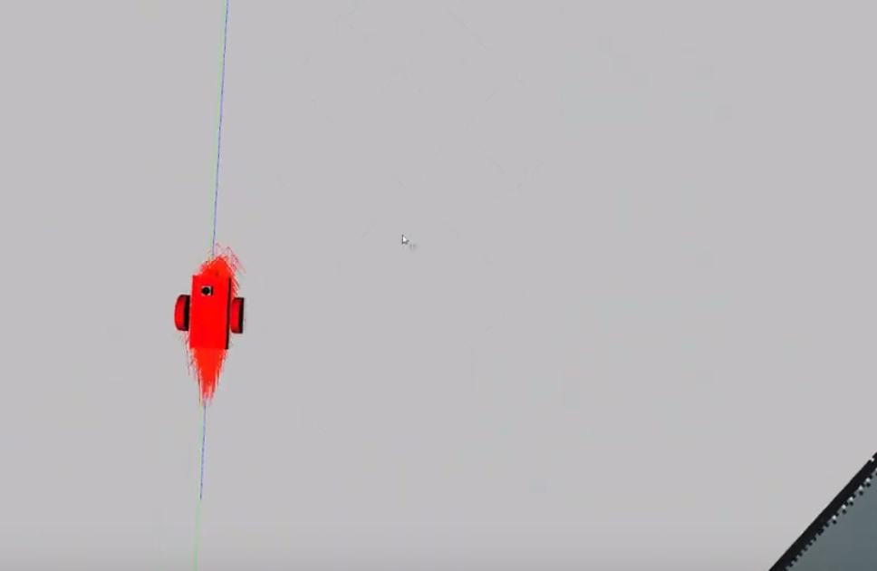

# Overview
Global localization is performed using the amcl ROS package, which implements the Adaptive Monte Carlo Localization technique. Path planning is done by using the move_base ROS package.

# Project Snapshots
You can watch the [Youtube Demo](https://youtu.be/-EFJjdzvmYg), but the following pictures fully describe what is happening during the MCL Localization.

The rover is spawned into the Gazebo simulation world.\
 

Since the rover doesn't know where it is, the particles are spread all over the map.\
 

As the rover moves around, it gradually becomes more certain of its location.\
  

Eventually, the rover has located itself and all the particles have gathered at the same spot.\
 

# Software
- ROS Kinetic
- Gazebo
- RViz
- amcl
- move_base

# Project Setup
For this setup, catkin_ws is the name of active ROS Workspace, if your workspace name is different, change the commands accordingly
If you do not have an active ROS workspace, you can create one by:

```sh
$ mkdir -p ~/catkin_ws/src
$ cd ~/catkin_ws/
$ catkin_make
```

Now that you have a workspace, clone or download this repo into the src directory of your workspace:
```sh
$ cd ~/catkin_ws/src
$ git clone https://github.com/chedanix/robotics_projects/tree/master/RoboND-Perception-Project
```

Now install missing dependencies using rosdep install:
```sh
$ cd ~/catkin_ws
$ rosdep install --from-paths src --ignore-src --rosdistro=kinetic -y
```
Build the project:
```sh
$ cd ~/catkin_ws
$ catkin_make
```

If you haven’t already, following line can be added to your .bashrc to auto-source all new terminals
```
source ~/catkin_ws/devel/setup.bash
```

# Launching the System
- source setup.bash
- `roslaunch udacity_bot udacity_world.launch`
- `roslaunch udacity_bot amcl.launch`
- `rosrun udacity_bot navigation_goal`
