# Table of Contents
[Overview](#Overview)\
[Project Snapshots](#Project-Snapshots)\
[Environment Setup](#Environment-Setup)\
[Dimensions from URDF](#Dimensions-from-URDF)\
[DH Notation](#DH-Notation)\
[Equations for First Three Joints](#Equations-for-First-Three-Joints)\
[Equations for Last Three Joints](#Equations-for-Last-Three-Joints)\
[Joint Limits](#Joint-Limits)

# Overview
The 6-DOF Kuka robotic arm follows paths to pick up objects and drop them in a basket. This project involves performing forward and inverse kinematics using DH notation.

See [YouTube Demo](https://youtu.be/K_WrAP1QHgo)
# Project Snapshots
The robot is spawned into the Gazebo world.
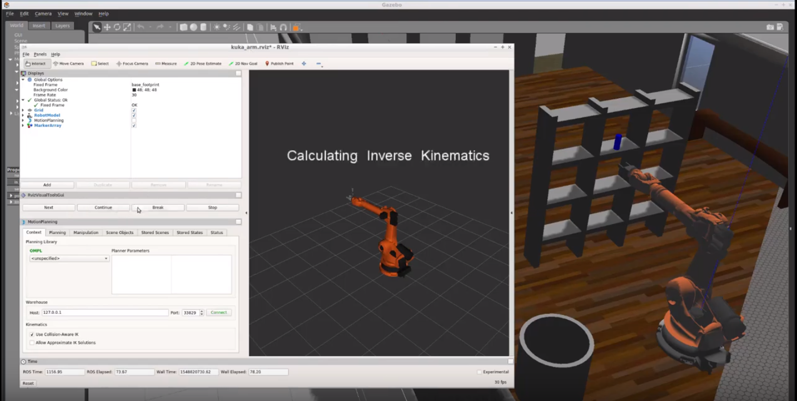

The robot has picked up the blue cylinder and is moving it to the basket.
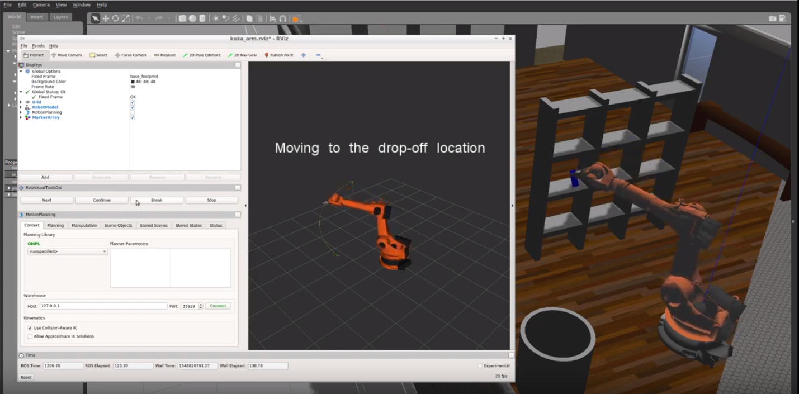

The robot is about to about to release the objects.
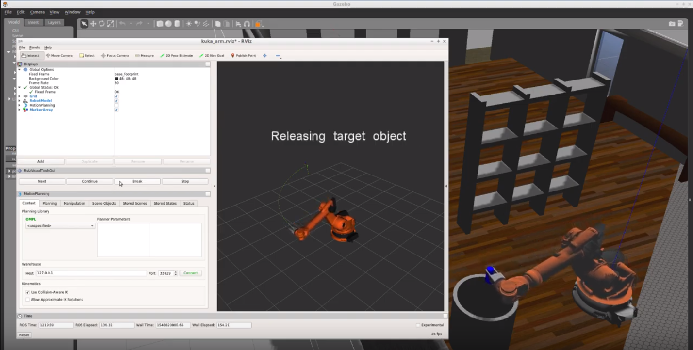

# Environment Setup
For the rest of this setup, catkin_ws is the name of active ROS Workspace, if your workspace name is different, change the commands accordingly.

If you do not have an active ROS workspace, you can create one by:\
`mkdir -p ~/catkin_ws/src`\
`cd ~/catkin_ws/`\
`catkin_make`

Now that you have a workspace, clone or download project repository into the src directory of your workspace:\
`cd ~/catkin_ws/src`
`git clone https://github.com/chedanix/robotics_projects/tree/master/RoboND-Kinematics-Project`

Now we will install missing dependencies"\
`cd ~/catkin_ws`
`rosdep install --from-paths src --ignore-src --rosdistro=kinetic -y`

Next we will change the permissions of script files to turn them executable:\
`cd ~/catkin_ws/src/RoboND-Kinematics-Project/kuka_arm/scripts`\
`sudo chmod u+x target_spawn.py`\
`sudo chmod u+x IK_server.py`\
`sudo chmod u+x safe_spawner.sh`

Now that everything is in place, it is time to build the project. From within your workspace you can run catkin_make to build the project:\
`cd ~/catkin_ws`\
`catkin_make`

Since the pick and place simulator spins up different nodes in separate terminals, you need to add the following to your .bashrc file for auto-sourcing:\
`source ~/catkin_ws/devel/setup.bash`

Open a terminal window and type in the following:\
`echo "export GAZEBO_MODEL_PATH=~/catkin_ws/src/RoboND-Kinematics-Project/kuka_arm/models" >> ~/.bashrc`

# Dimensions from URDF
The following dimensions are extracted from the Kuka arm URDF file.
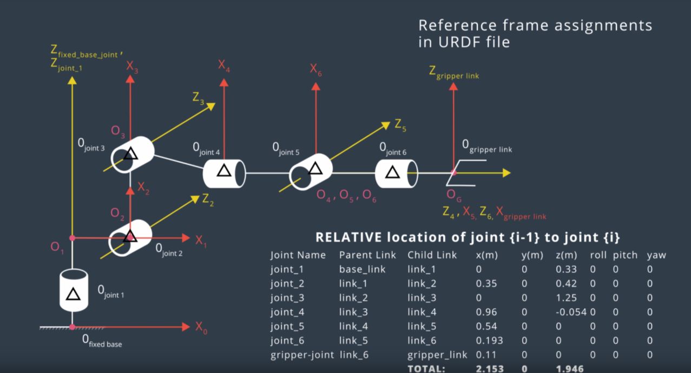

# DH Notation
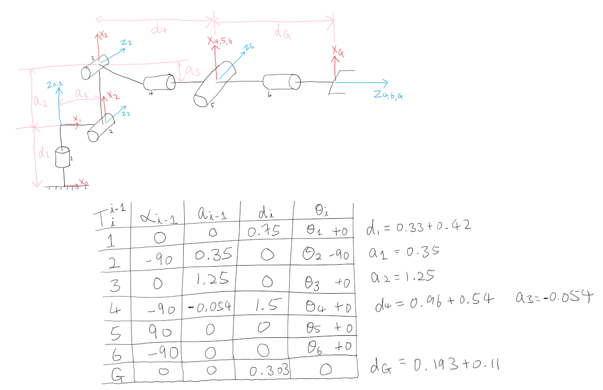
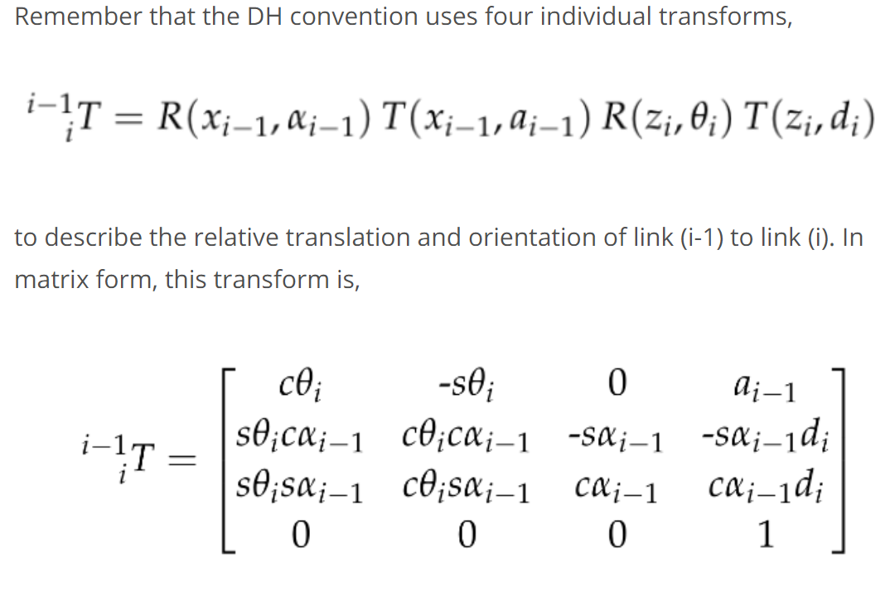

# Equations for First Three Joints
Here is a picture of the robotic arm with theta’s labelled. Note that two equations derived using the wrist center.\
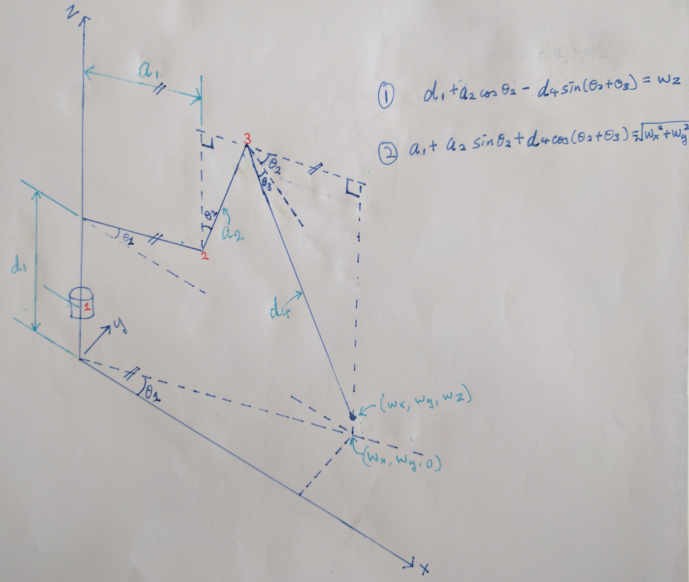

The two equations are manipulated, resulting in arcsin(theta3), which gives two solutions.
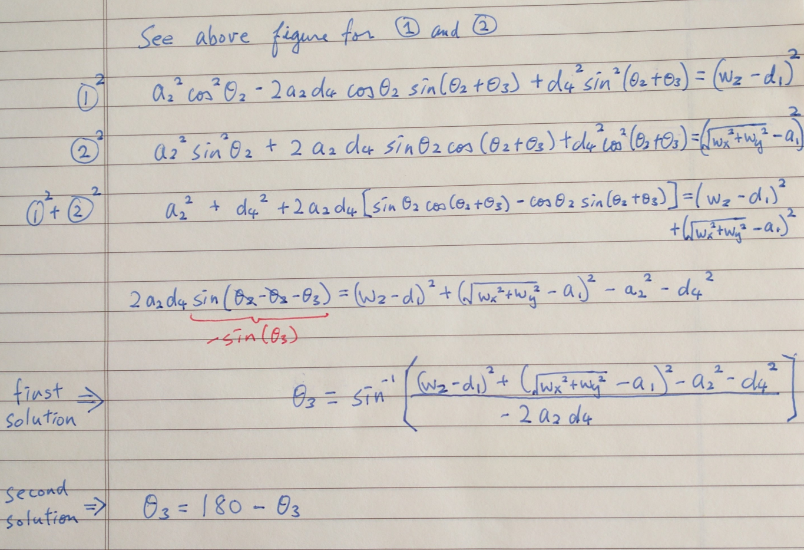

The respective theta2 to each theta3 can be found using atan2.
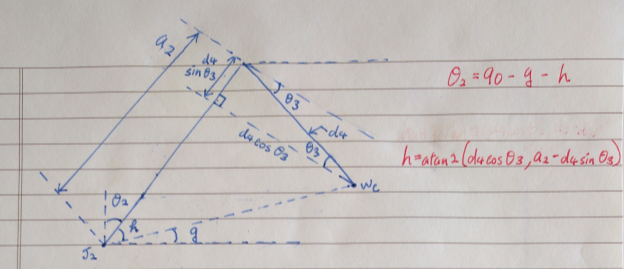

# Equations for Last Three Joints
To find theta4, theta5, and theta6, use atan2 by comparing the symbolic matrix and the numerical matrix of R3_G, which is the rotation matrix from DH frame 3 to the URDF gripper_link frame.
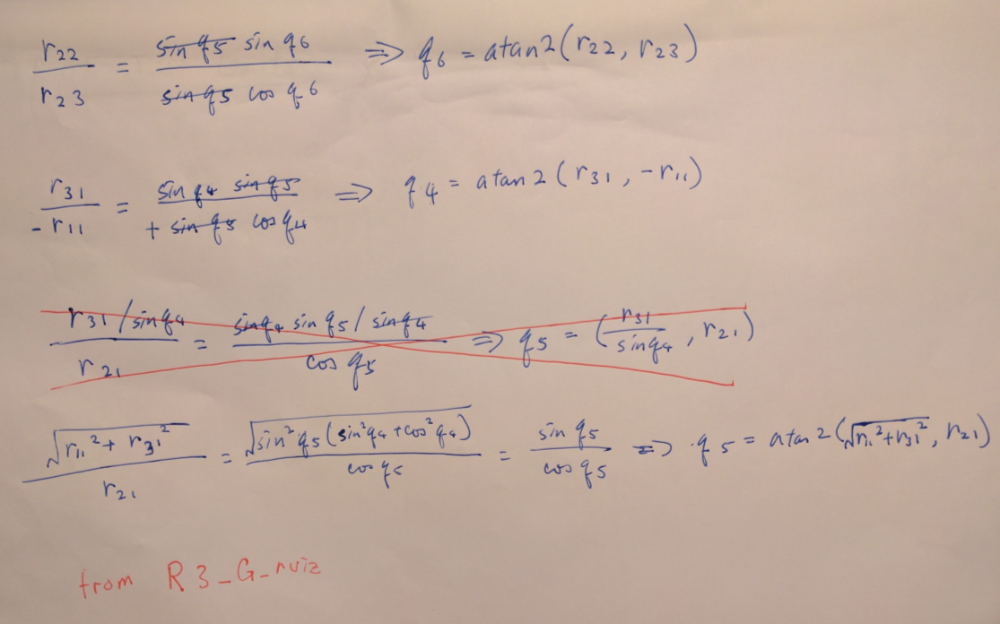

# Joint Limits
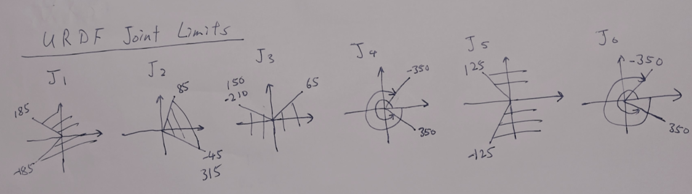
