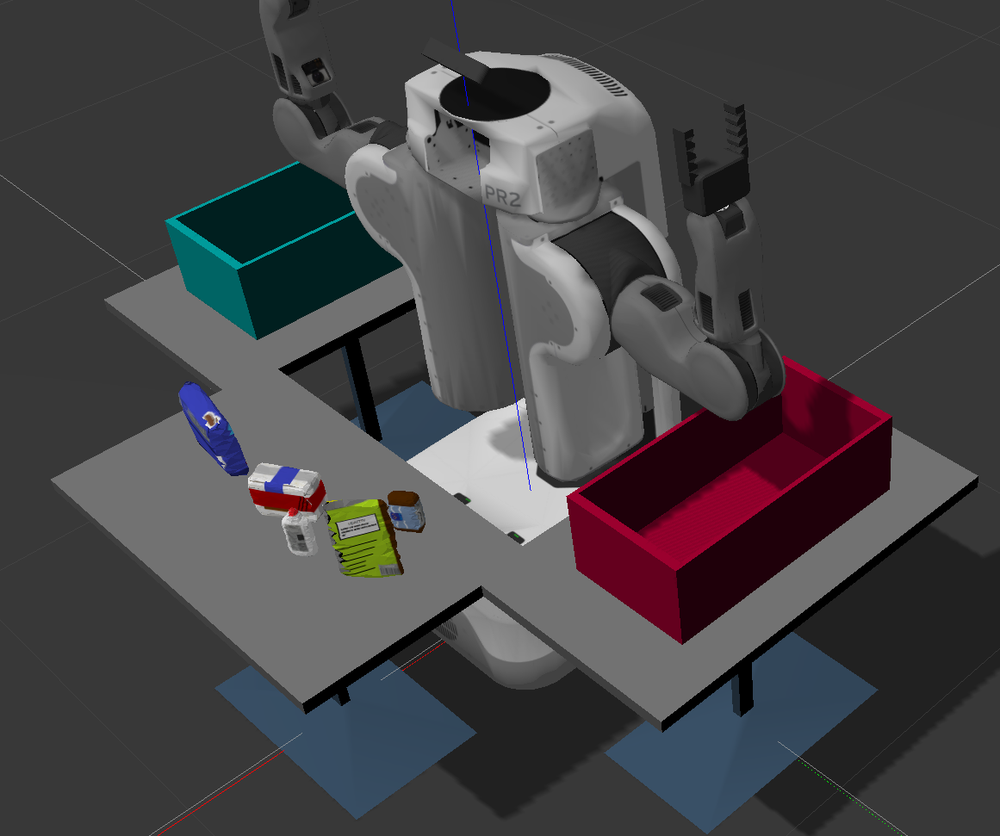
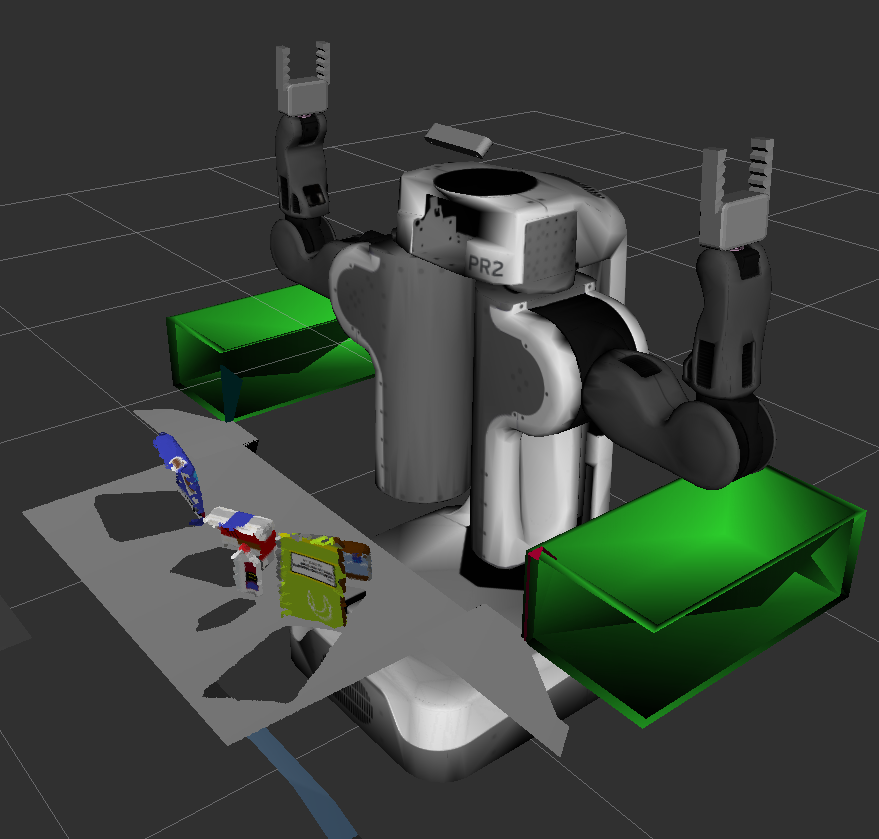
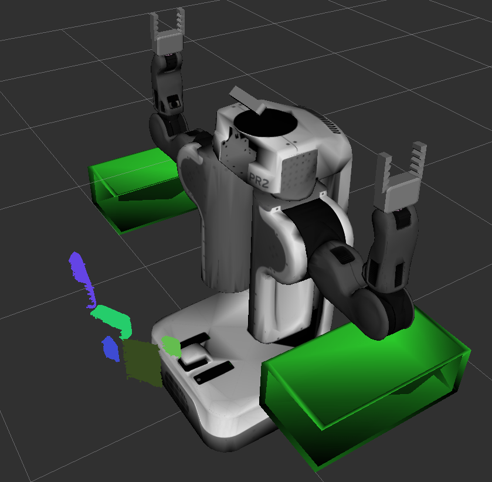
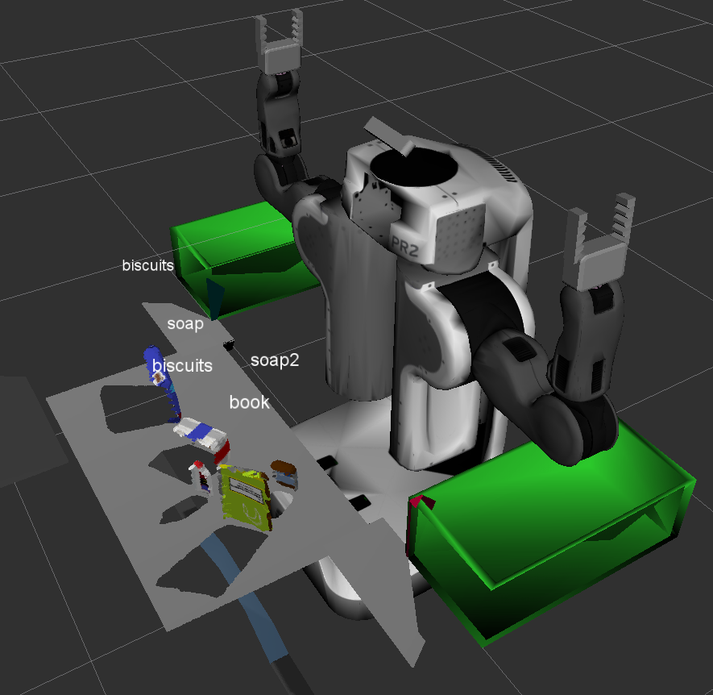

# Overview
The goal of the project is to detect and locate objects given Point Cloud data from an RGB-D camera. The data is filtered and segmented using the Point Cloud Library (PCL). The techniques applied include RANSAC, DBSCAN, Voxel Grid Down-sampling Filter, etc. An SVM model is also trained using color histogram for object recognition.

# Project Snapshots

The project takes place in a Gazebo simulation world, where there is a table full of objects and a robot equipped with an RGB-D Camera.\


The robot uses its RGB-D camera to generate a point cloud.\


Pass-through filter and RANSAC are used to remove the table.\


DBSCAN is used to segment the objects.\


SVM is applied to recognize the segmented objects.\



# Project Setup
For this setup, catkin_ws is the name of active ROS Workspace, if your workspace name is different, change the commands accordingly
If you do not have an active ROS workspace, you can create one by:

```sh
$ mkdir -p ~/catkin_ws/src
$ cd ~/catkin_ws/
$ catkin_make
```

Now that you have a workspace, clone or download this repo into the src directory of your workspace:
```sh
$ cd ~/catkin_ws/src
$ git clone https://github.com/chedanix/robotics_projects/tree/master/RoboND-Perception-Project
```

Now install missing dependencies using rosdep install:
```sh
$ cd ~/catkin_ws
$ rosdep install --from-paths src --ignore-src --rosdistro=kinetic -y
```
Build the project:
```sh
$ cd ~/catkin_ws
$ catkin_make
```
Add following to your .bashrc file
```
export GAZEBO_MODEL_PATH=~/catkin_ws/src/RoboND-Perception-Project/pr2_robot/models:$GAZEBO_MODEL_PATH
```

If you haven’t already, following line can be added to your .bashrc to auto-source all new terminals
```
source ~/catkin_ws/devel/setup.bash
```

# Launching the System
- open pr2_robot/launch/pick_place_project.launch and choose settings. For example: test3.world and pick_list_3.yaml
- Terminal 1
  - source setup.bash
  - `roslaunch pr2_robot pick_place_project.launch`
- Terminal 2
  - source setup.bash
  - `cd pr2_robot`
  - `rosrun pr2_robot project_template.py`
