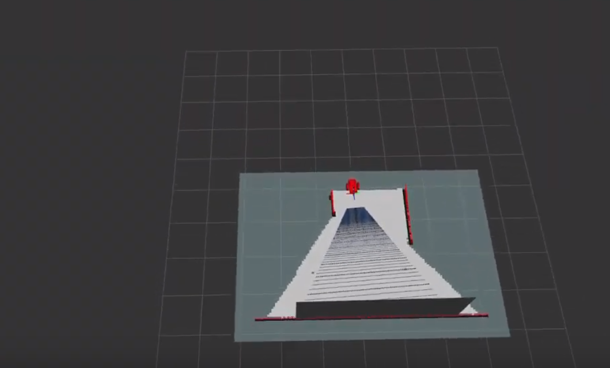
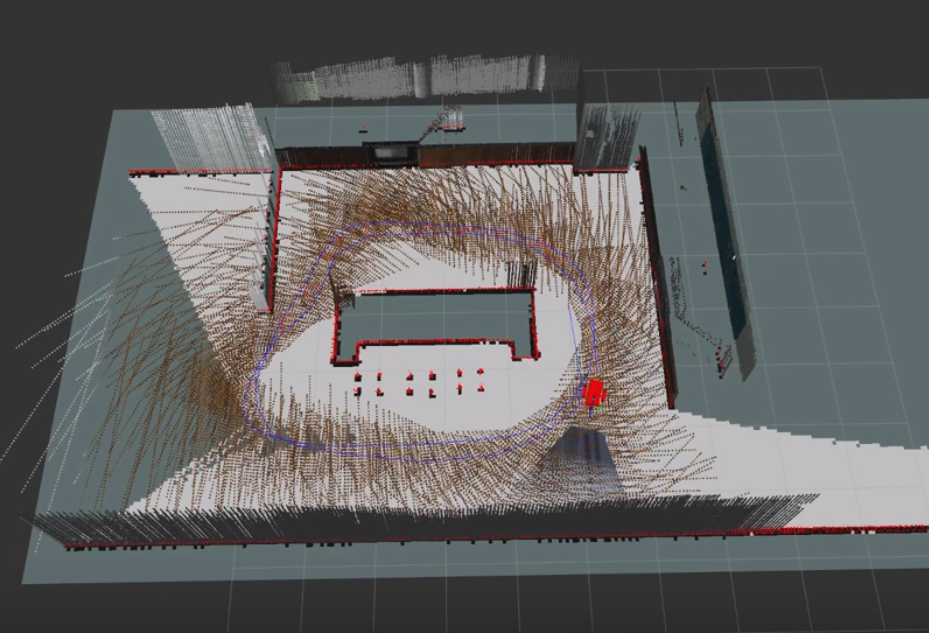

# Overview
A ROS package called RTAB-Map is used to perform graph SLAM in simulation.

See 

# Project Snapshots
The rover spawns into the Gazebo Simulation world.\

SLAM completed\

# Environment Setup
- Install dependencies
   - `sudo apt-get install ros-kinetic-rtabmap ros-kinetic-rtabmap-ros && sudo apt-get remove ros-kinetic-rtabmap ros-kinetic-rtabmap-ros`
- Install RTAB-map
   - `cd ~ && git clone https://github.com/introlab/rtabmap.git rtabmap && cd rtabmap/build && cmake .. && make && sudo make install`
- Add model collision adjustments
   - `curl -L https://s3-us-west-1.amazonaws.com/udacity-robotics/Term+2+Resources/P3+Resources/models.tar.gz | tar zx -C ~/.gazebo/`

# Launching
- `roslaunch slam_project world.launch`
- `roslaunch slam_project teleop.launch`
- `roslaunch slam_project mapping.launch`
- `roslaunch slam_project rviz.launch`

run this if rtabmap-databaseViewer gives the error "error while loading shared libraries":\
`sudo ldconfig`

If teleop can't be found, try making teleop.py executable.
